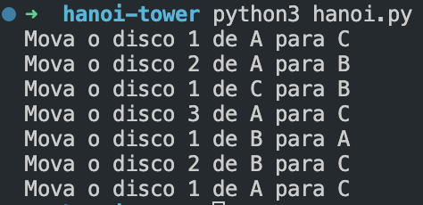

# Torre de Hanoi 🗼


Este repositório implementa uma solução recursiva para o clássico problema da Torre de Hanoi em Python.

## 🔍 Sobre o Problema

A Torre de Hanoi é um quebra-cabeça matemático que envolve mover discos entre três hastes, seguindo regras específicas.

## 🚀 Como executar

```bash
python hanoi.py no (windows)
python3 hanoi.py no (mac/linux)
